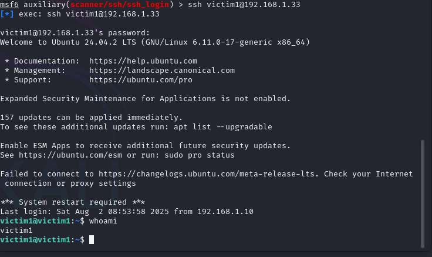
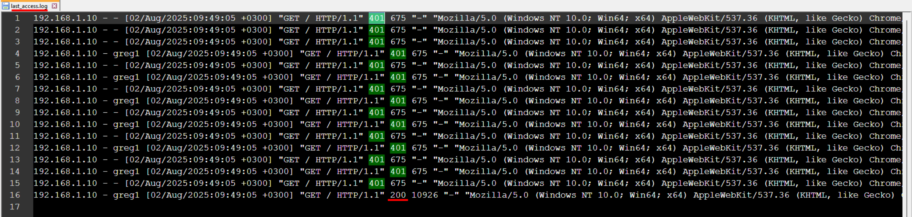

# SOC-PythonLogParser

*This project is a demonstration primarily created to showcase just a bit of my knowledge as a SOC Analyst.*

*This script is not suited for real life scenarios and it's only made to showcase knowledge on the topic and not the script itself.*
*Uses pyfiglet(for ASCII art, yes I KNOW! :)) and os modules.

**Use `pip install pyfiglet` to run, otherwise use soc-logparser_nofiglet.py.**
---
**SOC-PythonLogParser** is a Python tool designed to parse two common Linux log files:
- `/var/log/auth.log` — for SSH related log history
- `/var/log/apache2/access.log` — for Apache HTTP Server log history

The script detects signs of **SSH and HTTP brute force attacks**, and provides a clear summary of whether the system might be **compromised** or **not**, based on evidence found in the logs that matches with common/known attack techniques/artifacts.

**This project was executed with the following tools:**
- **Attacker VM:** Kali Linux (Metasploit Framework)
- **Victim VM:** Ubuntu Linux (OpenSSH, Apache2) -> Tweaked OS Settings to be vulnerable(like password complexity)
- **Virtualization:** VMware Workstation
- **Network Type:** Lan Segment (without internet access)
Basically : Kali Linux (Attacker) - Ubuntu (Victim) 

<div align="center"><b>Lab Setup:</b></div>
<p align="center">
  
</p>

## Attack Scenarios

### 1. SSH Brute Force Attack
- **Tool Used:** Metasploit `auxiliary/scanner/ssh/ssh_login` with "rockyou.txt" password list
- **Target:** Ubuntu's OpenSSH service(was not installed by default from Ubuntu and was installed afterwards for demonstration purposes)
- **Log Evidence:** `/var/log/auth.log`
- **Indicators:**
  - Multiple "Failed password" entries from the same IP
  - Sudden successful login from same IP, that previously failed to enter the correct password

*auth.log snippet:*
```
2025-08-02T09:07:32.262858+03:00 victim1 sshd[3393]: Failed password for victim1 from 192.168.1.10 port 40601 ssh2
2025-08-02T09:07:34.104884+03:00 victim1 sshd[3393]: Connection closed by authenticating user victim1 192.168.1.10 port 40601 [preauth]
2025-08-02T09:07:34.107744+03:00 victim1 sshd[3395]: Connection from 192.168.1.10 port 34943 on 192.168.1.33 port 22 rdomain ""
2025-08-02T09:07:34.196932+03:00 victim1 sshd[3395]: pam_unix(sshd:auth): authentication failure; logname= uid=0 euid=0 tty=ssh ruser= rhost=192.168.1.10  user=victim1
2025-08-02T09:07:36.473696+03:00 victim1 sshd[3395]: Failed password for victim1 from 192.168.1.10 port 34943 ssh2
2025-08-02T09:07:38.102461+03:00 victim1 sshd[3395]: Connection closed by authenticating user victim1 192.168.1.10 port 34943 [preauth]
2025-08-02T09:07:38.103429+03:00 victim1 sshd[3397]: Connection from 192.168.1.10 port 34145 on 192.168.1.33 port 22 rdomain ""
2025-08-02T09:07:38.214937+03:00 victim1 sshd[3397]: Accepted password for victim1 from 192.168.1.10 port 34145 ssh2
2025-08-02T09:07:38.217306+03:00 victim1 sshd[3397]: pam_unix(sshd:session): session opened for user victim1(uid=1000) by victim1(uid=0)
2025-08-02T09:07:38.223126+03:00 victim1 systemd-logind[896]: New session 5 of user victim1.
```
Executed using Metasploit:
<p align="center">
  
</p>

Successful SSH into Victim's Machine :
<p align="center">
  
</p>

Victim's Machine auth.log Overview:
<p align="center">
  
</p>

##
### 2. HTTP Brute Force Attack
- **Tool Used:** Metasploit `auxiliary/scanner/http/http_login` with "rockyou.txt" password list (you can use any other brute force password list too)
- **Target:** Apache2 with Basic Authentication 
- **Log Evidence:** `/var/log/apache2/access.log`
- **Indicators:**
  - Repeated 401 Unauthorized responses from same IP
  - Eventual 200 OK response to same IP


Example log snippet:

```log
192.168.1.10 - - [02/Aug/2025:09:49:05 +0300] "GET / HTTP/1.1" 401 675 "-" "Mozilla/5.0 (Windows NT 10.0; Win64; x64) AppleWebKit/537.36 (KHTML, like Gecko) Chrome/129.0.0.0 Safari/537.36 Edg/129.0.2792.79"
192.168.1.10 - greg1 [02/Aug/2025:09:49:05 +0300] "GET / HTTP/1.1" 401 675 "-" "Mozilla/5.0 (Windows NT 10.0; Win64; x64) AppleWebKit/537.36 (KHTML, like Gecko) Chrome/129.0.0.0 Safari/537.36 Edg/129.0.2792.79"
192.168.1.10 - - [02/Aug/2025:09:49:05 +0300] "GET / HTTP/1.1" 401 675 "-" "Mozilla/5.0 (Windows NT 10.0; Win64; x64) AppleWebKit/537.36 (KHTML, like Gecko) Chrome/129.0.0.0 Safari/537.36 Edg/129.0.2792.79"
192.168.1.10 - greg1 [02/Aug/2025:09:49:05 +0300] "GET / HTTP/1.1" 401 675 "-" "Mozilla/5.0 (Windows NT 10.0; Win64; x64) AppleWebKit/537.36 (KHTML, like Gecko) Chrome/129.0.0.0 Safari/537.36 Edg/129.0.2792.79"
192.168.1.10 - - [02/Aug/2025:09:49:05 +0300] "GET / HTTP/1.1" 401 675 "-" "Mozilla/5.0 (Windows NT 10.0; Win64; x64) AppleWebKit/537.36 (KHTML, like Gecko) Chrome/129.0.0.0 Safari/537.36 Edg/129.0.2792.79"
192.168.1.10 - greg1 [02/Aug/2025:09:49:05 +0300] "GET / HTTP/1.1" 401 675 "-" "Mozilla/5.0 (Windows NT 10.0; Win64; x64) AppleWebKit/537.36 (KHTML, like Gecko) Chrome/129.0.0.0 Safari/537.36 Edg/129.0.2792.79"
192.168.1.10 - - [02/Aug/2025:09:49:05 +0300] "GET / HTTP/1.1" 401 675 "-" "Mozilla/5.0 (Windows NT 10.0; Win64; x64) AppleWebKit/537.36 (KHTML, like Gecko) Chrome/129.0.0.0 Safari/537.36 Edg/129.0.2792.79"
192.168.1.10 - greg1 [02/Aug/2025:09:49:05 +0300] "GET / HTTP/1.1" 401 675 "-" "Mozilla/5.0 (Windows NT 10.0; Win64; x64) AppleWebKit/537.36 (KHTML, like Gecko) Chrome/129.0.0.0 Safari/537.36 Edg/129.0.2792.79"
192.168.1.10 - - [02/Aug/2025:09:49:05 +0300] "GET / HTTP/1.1" 401 675 "-" "Mozilla/5.0 (Windows NT 10.0; Win64; x64) AppleWebKit/537.36 (KHTML, like Gecko) Chrome/129.0.0.0 Safari/537.36 Edg/129.0.2792.79"
192.168.1.10 - greg1 [02/Aug/2025:09:49:05 +0300] "GET / HTTP/1.1" 200 10926 "-" "Mozilla/5.0 (Windows NT 10.0; Win64; x64) AppleWebKit/537.36 (KHTML, like Gecko) Chrome/129.0.0.0 Safari/537.36 Edg/129.0.2792.79"

```
Executed using Metasploit:
<p align="center">
  
</p>

Victim's Machine access.log Overview:
<p align="center">
  
</p>

## Parser's function

The Python script does the following:
- Reads both auth.log and access.log
- Searches for known patterns indicating brute force attempts
- Outputs whether the system is potentially compromised or not

Example Output
```
Parsing SSH auth logs...
[!] Possible SSH brute force detected and was potentially successful: 8 failed attempts and 1 succeeded.

Parsing Apache logs...
[!] Possible HTTP brute force and was potentially successful: 1547 failed and 3 succeeded.


 --- Parser detected that the system is possibly compromised through both SSH and HTTP Brute force attacks! ---
```
Parser's Output Overview:
<p align="center">
  
</p>

## Takeaways as a SOC Analyst
Brute force attacks are noisy and can often be detected by many failed login patterns.
A series of failed attempts, following a successful login from same IP, is a strong compromise indicator.
Log analysis (like the 1 Linux log file and the 1 Apache log file in this demonstration) is a fundamental skill in incident detection & response.
